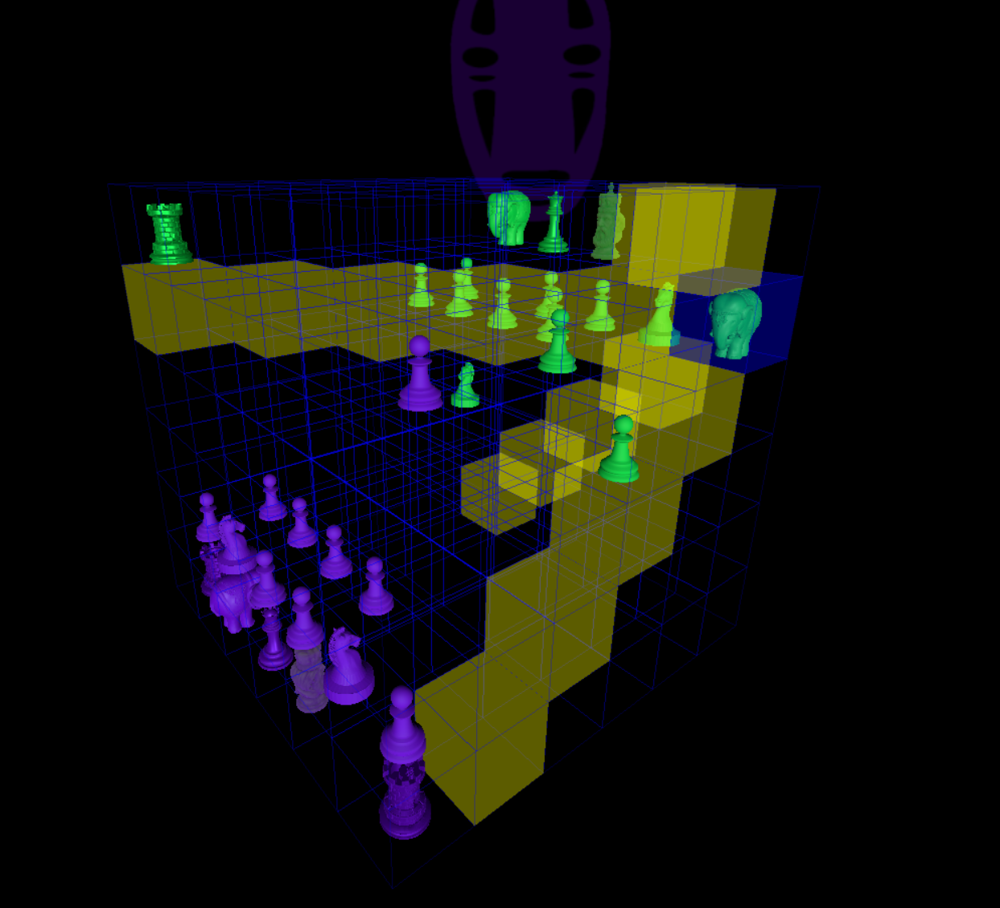

# ♟️ ParadoxChess

> Chess. But not as you know it.

**ParadoxChess** is an experimental online multiplayer chess game played in a **3D multidimensional space**. Built from scratch with custom game mechanics, real-time multiplayer, and a fully interactive 3D board rendered in the browser.



🎮 **Live demo:** https://paradoxchess.onrender.com/

---

## Features

- **3D Space** — the board exists in a three-dimensional environment built with Three.js. Rotate, zoom, and explore the game from any angle.
- **Custom mechanics** — not your standard chess ruleset. ParadoxChess introduces its own piece behavior and movement logic.
- **Real-time multiplayer** — play against others live via WebSockets (Socket.io). No polling, no page reloads.
- **Session support** — persistent sessions via express-session keep your game state intact.

---

## Tech Stack

| Layer | Technology |
|---|---|
| Server | Node.js, Express 5 |
| Real-time | Socket.io, ws |
| 3D Rendering | Three.js |
| Templating | EJS |
| Sessions | express-session |

---

## Getting Started

### Prerequisites

- Node.js 18+
- npm

### Installation

```bash
git clone https://github.com/roman-shneer/paradoxchess.git
cd paradoxchess
npm install
```

### Configuration

Edit `includes/config.js` to change the port if needed (default: `5000`):

```js
web_port: 5000
```

### Run

```bash
node index.js
```

Open http://localhost:5000 in your browser.

---

## Project Structure

```
paradoxchess/
├── includes/       # Server-side logic, config, game engine
├── public/         # Static assets (JS, CSS, images)
├── views/          # EJS templates
└── index.js        # Entry point
```

---

## Author

**Roman Shneer**

---

## License

ISC
